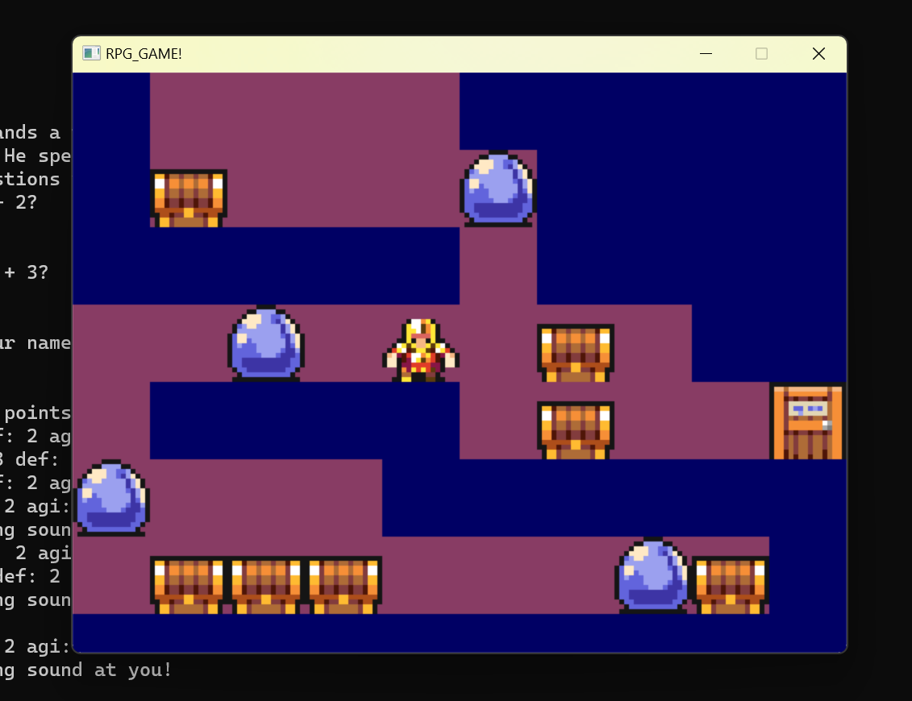

# RPG-Game-Project

A C++ Prototype of Role Playing Game using C++ / SDL2 / Tiled

## Table of contents

- [Overview](#overview)
  - [Screenshot](#screenshot)
  - [Features](#features)
  - [Lessons](#lessons)
  - [ToDo's](#todos)

## Overview

I built a prototype of a simple dungeon using C++, Visual Studio C++, and SDL2 library in order to learn syntax, OOP principles using a game as a vehicle.

### Screenshot

<a href="url"></a>

### Features

- Player can choose a class which decides its HP, Strength, Agi, Defense
- Player can fight a glob until it's out of health or player dies.
- Player player can use input keys to move the hero around a grid with Globs, Mimics(they will attack), Chests, and an exit

### Lessons

- Learned about language syntax (C++), header files, pointers, object oriented programming, data structures (Lists, Maps, Arrays)

- In as much as possible, the functions of each the Map rendering, game logic, and Models are separate in their implementation. Private fields, private functions and good programming practices allowed for encapsulation.

- Polymorphism in this game allows Player and Monsters to inherit the Character class. This allowed me to process/code behavior for both Player and Monsters while simultaneously allowing them to have unique behaviors (HP, Agi, Def whereas Globs can Shriek() ).

- There is a lot of boiler plate code in order to initialize SDL

- Lists, Arrays, and Maps are Data Structures that can be utilized to hold a players items, tile data but in this small demo, maps are unnecessary

### Todos

- Utilize or create a Tiled map parser in order to create more complex tiled maps
- Finish a fully functional level
- Add the battle game loop from the console game to the rendered game and providing useful information to the player

### Credits

Assets are used for learning purposes only. Support 7Soul's sprite set if you like the Sprite set and Tiles. [7Soul's Itch.io](https://7soul.itch.io/7souls-rpg-graphics-sprites)

SDL and main game loop inspired by ChatGPT output and Matthew Carr's Let's Learn C++ and Make a 2D Dungeon game! [Matthew Carr's Tutorial](https://www.udemy.com/course/2d-dungeon-game/)

### How to Play / Test

Clone the repo on a Windows x64 machine and start the "RPG Game Project.exe" file in the directory or compile and run the solution.

```
 \RPG-Game-Project\x64\Debug\RPG Game Project.exe
```
